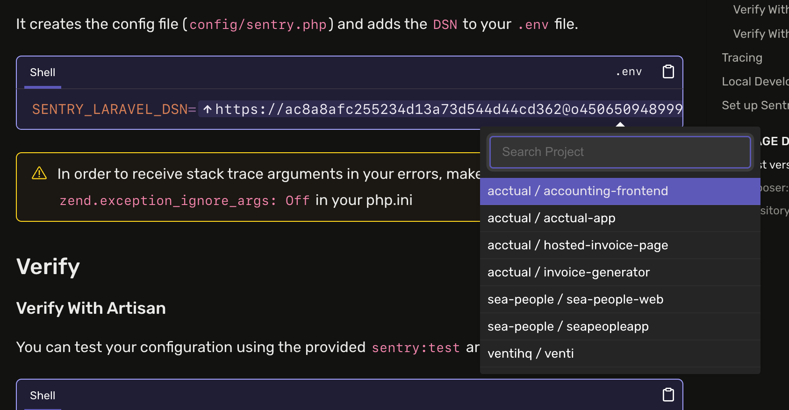

# Sentry with Laravel

- Why no wizzard?
- <https://docs.sentry.io/platforms/php/guides/laravel/#install> - code snipped section - probably should show diff of what we're adding rather than saying "by making the following change to your bootstrap/app.php file" since it's only the use Sentry and Integration inside withExceptions

- 
  <https://docs.sentry.io/platforms/php/guides/laravel/#configure> - Add an option to create a new project from the dropdown

- php artisan sentry:publish --dsn command asked if I wanted to send a test event, I said yes. Logs said Test event sent with ID, checked Sentry feed for the app, didn't see any events - [edit] for some reason the feed was set to a specific date which was august 14, 2024, so bizzare have no clue what happened here, I do see the errors now though. The install (setup) screen in the Sentry dashboard wasn't listening to events though, probably a nice little win there. Since the install screen says to use php artisan sentry:test separately, but it's part of the publish flow.
- I picked React in the wizzard flow for Laravel, however the Laravel docs don't have any section for frontend frameworks
- php artisan is kind of the sentry wizzard i guess in this case? Maybe it can check package.json and see which frontend frameworks are being used and invite users to configure / install the necessary SDKs and configure Session Replay, etc?
- Configure React SDK in app has options to enable tracking and session replay but not logs like <https://docs.sentry.io/platforms/javascript/guides/react/>
- <https://docs.sentry.io/platforms/javascript/guides/react/#step-6-add-readable-stack-traces-with-source-maps-optional> command doesn't have `--saas` that configure SDK screen in Sentry does
